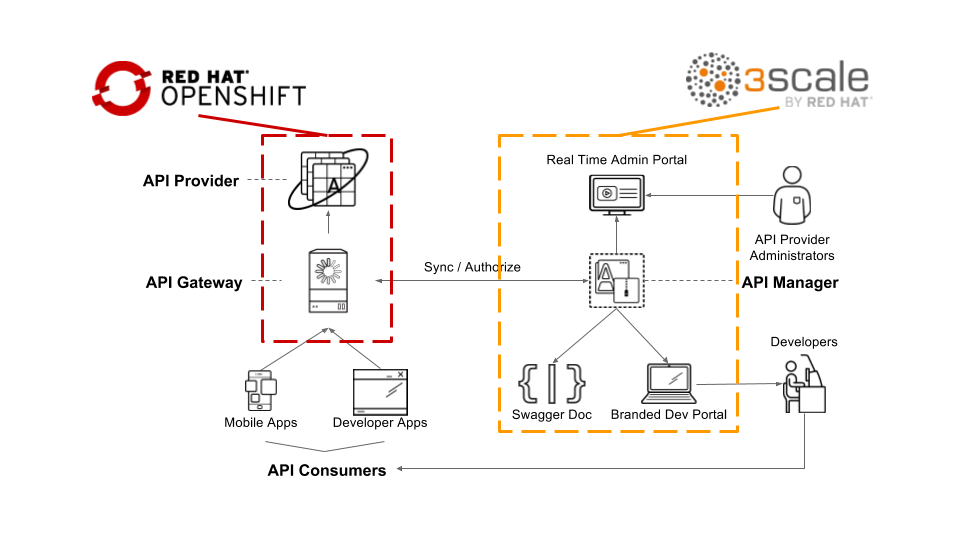
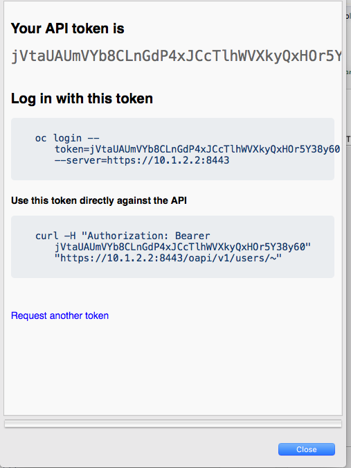

# Red Hat Agile API Integration Workshop - Microservices-based Managed API Integration

This very simple lab will guide you to create your very first Fuse-based SpringBoot microservice project running on OpenShift 4. There are 4 sections in the labs.

* Create a project that reads from a database
* Expose a restful API endpoint to access data in the database
* Add/Commit source to a GIT repository
* Deploy your application on OpenShift*
* Create your first SpringBoot Fuse Transformer project
* Optional: Manage and control the access to your API using 3scale

## Red Hat 3scale API Management Platform Account
This lab focuses on the deployment and administration of Red Hat 3Scale. One deployment topology available is known as a *hybrid* approach. A *hybrid* Red Hat 3Scale deployment topology is one in which the 3Scale API gateway is self-managed in your own environment. This self-managed API gateway is in two-way communication with the hosted Red Hat 3Scale SaaS API Management Platform (AMP).



The focus of lab 04 of this course is on this hybrid deployment topology. Subsequently, the lab 04 make heavy use of your account in the Red Hat 3Scale SaaS AMP. If you do not have a Red Hat 3Scale SaaS, please register for free trial one at: [https://www.3scale.net/signup/](https://www.3scale.net/signup/).

You will receive an email in your inbox to complete the signup process and activate your account.

## Installation
Before you begin, please make sure the following software are properly installed

* CodeReady Studio 12.0.15.GA with Integration plugin installed
https://developers.redhat.com/products/codeready-studio/download
* Java Platform, Standard Edition 1.8.0+
* An Openshift 4.2 (or major) environment access
> Note: If you don't have a Openshift environment, you can download for free and install a local one in your laptop. Just follow steps in this link: [CodeReady Containers](https://developers.redhat.com/products/codeready-containers/overview)


## Installing and setup development environment
1. Download Red Hat CodeReady Studio from [Link](https://developers.redhat.com/products/codeready-studio/download)
2. Follow steps acording you S.O.: https://developers.redhat.com/products/codeready-studio/hello-world
3. Immediately after installation, you will be prompted to select a workspace for your Red Hat CodeReady Studio project. Select any path of your choice.
4. Once inside Red Hat CodeReady Studio, select "Software/Update" tag in the middle panel. Check the "JBoss Fuse Development" box and click on Install/Update button.
> Note: If there isn't a "JBoss Fuse Development" in the list, check "Show installed" option in the upper right corner in order to see if the plugin is already installed. Some latest CodeReady Studio versions might already have this plugin installed out-of-the-box.


5. Red Hat CodeReady Studio will restart.


### Install Fuse image stream on OpenShift and Database template for this lab (as admin user)

```
#FIS image
oc create -f https://raw.githubusercontent.com/jboss-fuse/application-templates/master/fis-image-streams.json -n openshift

#MYSQL Database
oc create -f https://raw.githubusercontent.com/openshift/origin/master/examples/db-templates/mysql-ephemeral-template.json -n openshift
```

Log back in as developer user

```
oc login [openshift-environment-apiurl]:6443 -u [dev-user]

```

Going back to Red Hat CodeReady Studio, in OpenShift Explorer view, click on **New Connection Wizard..** to configure OpenShift setting
Enter **openshift-api-url:6443** as the **Server** and click on the **retrieve** link to access the token.



In the popup window, log in as Developer using your user and pasword. Select ok and check the **Save token** box.


## Windows Users

- Make sure you disable  Hyper-V functionality under Control Panel when using CodeReady Container local Openshift environment.

Thanks to @sigreen

## FAQ
- How to install Maven?  
	- Go to https://maven.apache.org/install.html for detail instructions
- Maven dependency not found?
	- ${MAVEN_INSTALLED_DIR} if you are having trouble downloading from the repositories
