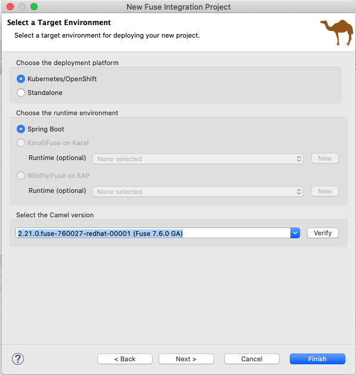
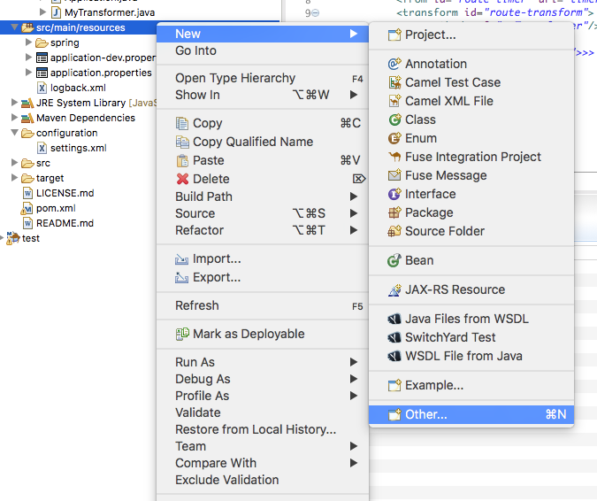
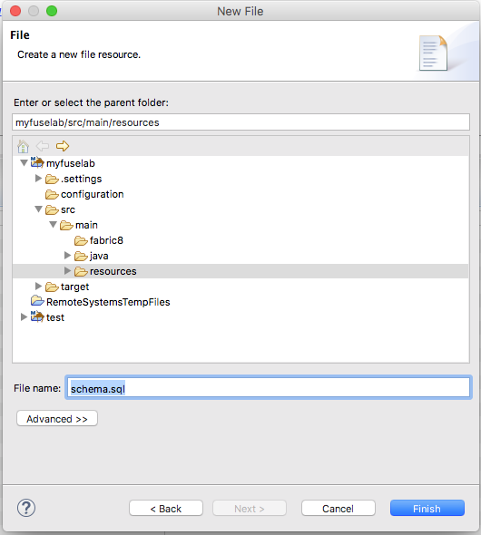
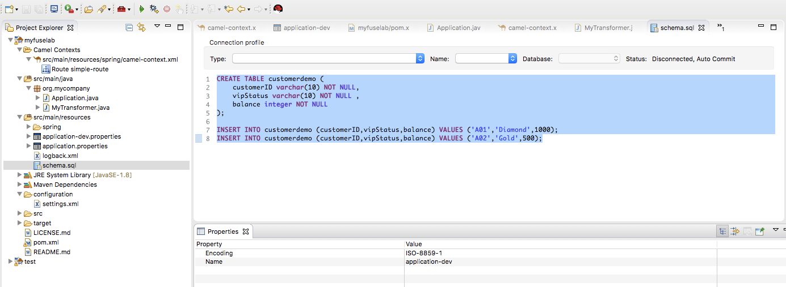
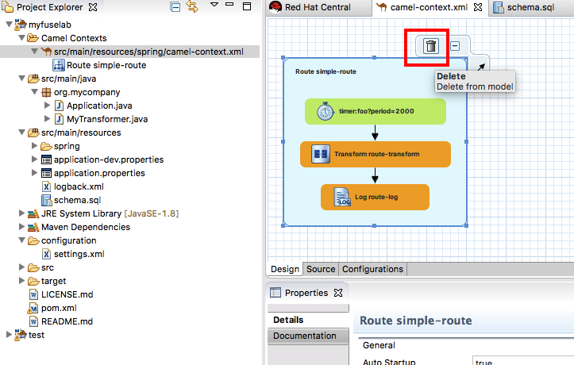
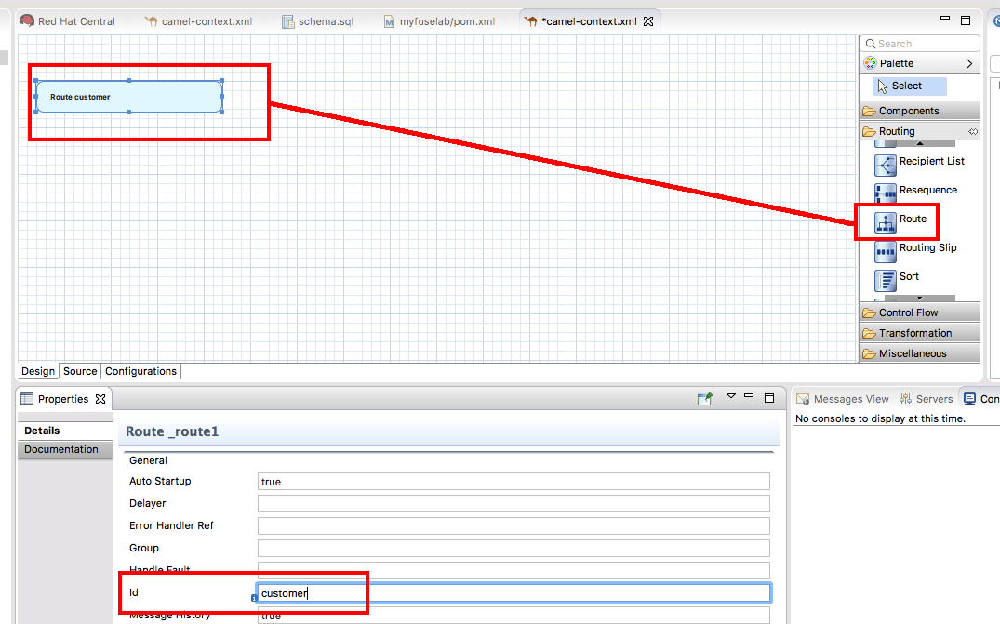
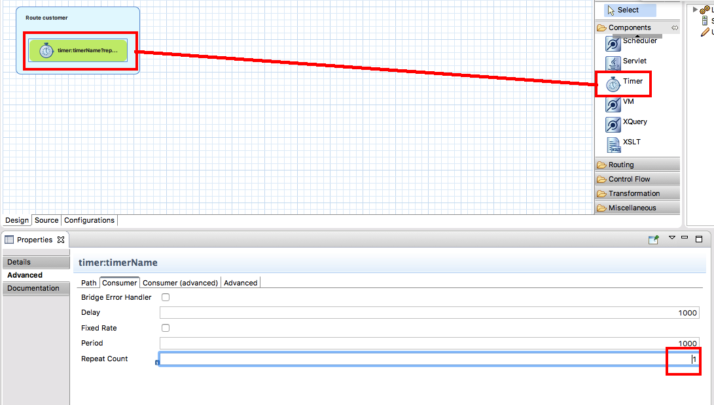
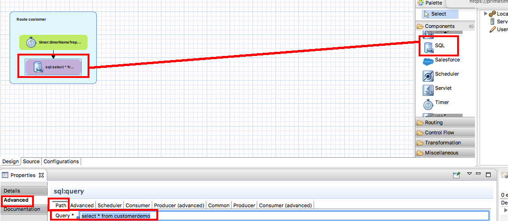
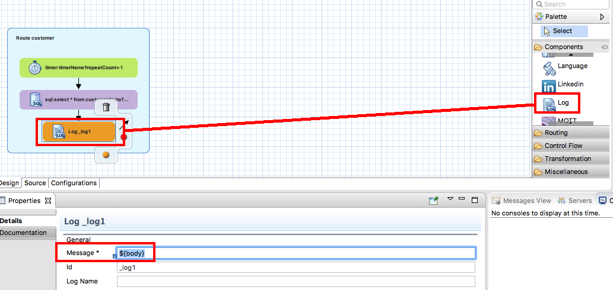
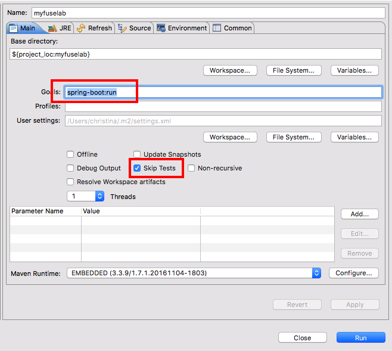

## Lab one - Create first SprintBoot Fuse project
In JBoss Developer Studio, create a new project by right click in the project explorer panel, select **New** -> **Fuse Integration Project**


Enter **myfuselab** as the project name, and click *next*
In select target runtime, click *next*


In Advance project setup, choose **Use a predefined template** and select **Fuse on OpenShift** -> **SprintBoot on OpenShift** and click *finish*


Under *src/main/resources* duplicate **application.properties** and with name **application-dev.properties**, we are going to use this as the setting during our developement time.


Add the following datasource configuration to file **application-dev.properties**,

```
#Database configuration
spring.datasource.url = jdbc:h2:mem:mydb;DB_CLOSE_DELAY=-1;DB_CLOSE_ON_EXIT=FALSE
spring.datasource.username = sa
spring.datasource.password = 
spring.datasource.driver-class-name = org.h2.Driver
spring.datasource.platform = h2
```
*note: we are using H2 in memory database for testing. And thanks to autowiring in SpringBoot, it is now automatically loaded and wired as the default datasource to the Camel context*

Create a new file under *src/main/resources* by right click on the folder itself in the project explorer panel, select **New** -> **Others**


In Select a wizard, choose **File** and click next,

In File, put **schema.sql** as the file name, and make sure it's under the myfuselab project *src/main/resources* and select finish.


Add the following SQL to **schema.sql**

```
CREATE TABLE customerdemo (
	customerID varchar(10) NOT NULL,
	vipStatus varchar(10) NOT NULL ,
	balance integer NOT NULL
);

INSERT INTO customerdemo (customerID,vipStatus,balance) VALUES ('A01','Diamond',1000);
INSERT INTO customerdemo (customerID,vipStatus,balance) VALUES ('A02','Gold',500);
```


Double click on the **camel-context.xml** file under **Camel Contexts**, you will see the Camel route, delete the simple-route in the canvas.


Create a new route by draging **ROUTE** component from the *Routing* palette on the right. Name the route to **customer** by entering it in the *ID* textbox in the properties section.


Use Timer to kick start the route, drag the **TIMER** component from the *Components* palette on the right, and drag it to the route into the canvas. Under *Properties*-> *Advance* tab -> *Consumer* , set **Repeat Count** to **1**


To read data from the datasource, select **SQL** component from the *Components* palette on the right to the route. Under *Properties*-> *Advance* tab -> *Path*, set **Query** to **select * from customerdemo** 


and in *Common* tab set **Data Source** to **dataSource**


And lastly select **LOG** component from the *Components* palette to the end of route. Under *Properties*-> *Detail* tab, set **Message** to **${body}**


Before we kick start the application, add the database driver dependency in the **pom.xml** file

```
<dependencies>
	...
    <dependency>
      <groupId>com.h2database</groupId>
      <artifactId>h2</artifactId>
      <scope>runtime</scope>
    </dependency>
    ...
</dependencies>
```
Right click on the **myfuselab** in the project explorer panel, select **Run As..** -> **Maven build** 


in the pop-up windown enter **spring-boot:run** in *Goals* and select **Skip Tests**.


In you log console, verify that cutomer data are printed.
```
customer - [{CUSTOMERID=A01, VIPSTATUS=Diamond, BALANCE=1000}, {CUSTOMERID=A02, VIPSTATUS=Gold, BALANCE=500}]
```
