## Lab three - Create a GIT repository for your code

In this lab we are going to sync our code with a new GIT repo. We are refering/using a Gogs Git server deployed into Openshift (In this [link](https://github.com/OpenShiftDemos/gogs-openshift-docker) you can see how to do that)
You are free to use any other Git public/private repo like Github, Gitlab, etc.

> We will be referencing this Git server url as: $GIT_URL
  
> And the Git user will be: user1

## Create a repository 
1. Go to the $GIT_URL and then create a new account named "user1" password "openshift".

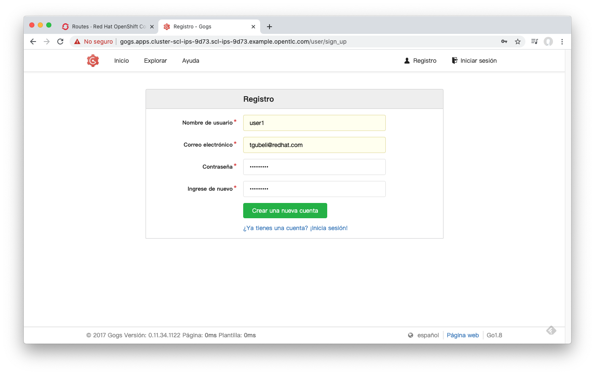

2. Now login with that account.

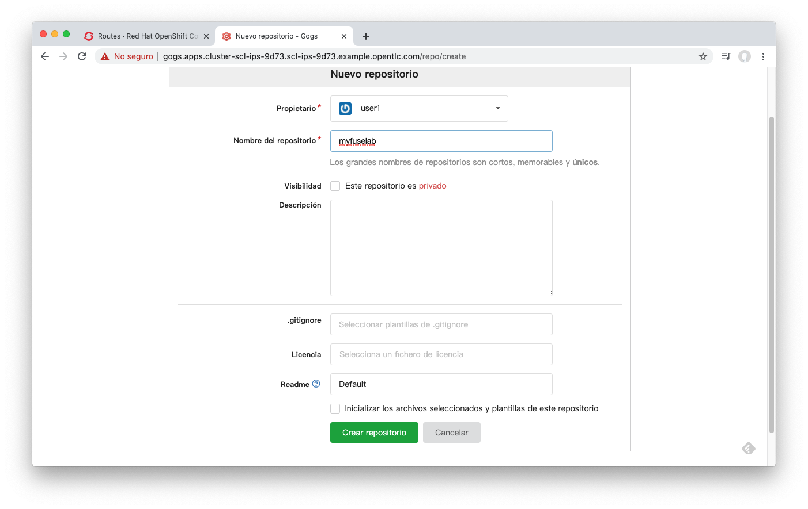

3. Then create a new repo named: "myfuselab"

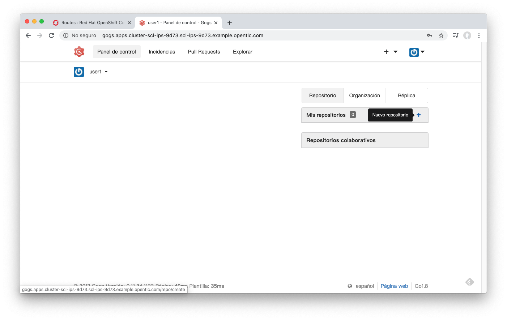

## Sync your local code with your new Git repo
1. In CodeReady Studio (CRS), go to "*Window > Perspective > Show Perspective > Other ...*"

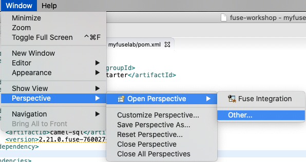

2. Select the Git perspective

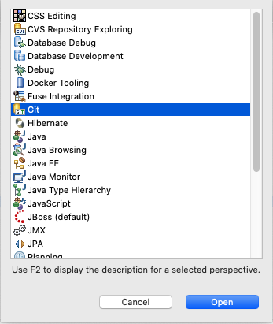

3. Create new Git Repo in CodeReady Studio...
Go to the icon that says Create new Git repo and click on it.

4. Fill all with your Git repo info then click Next...

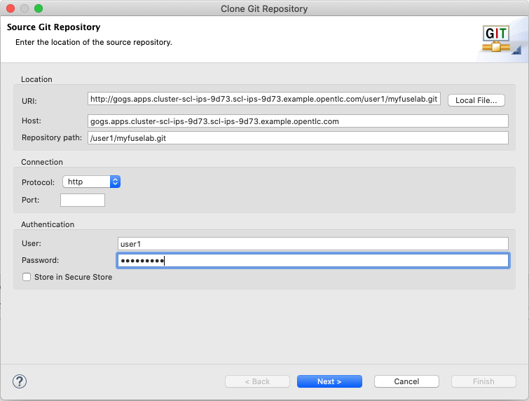

5. In the next screen do not select nothing, just click Next...

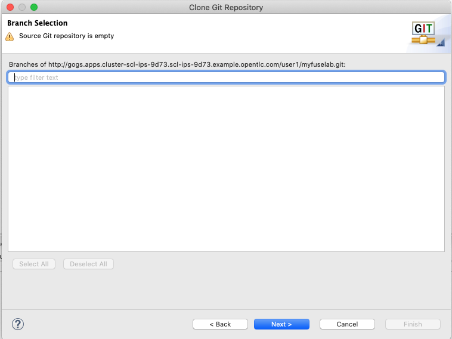

6. Then in the final screen select some local directory from your disk. Then click Finish.

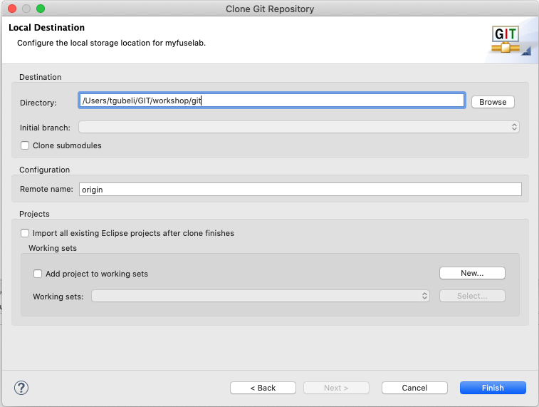

7. Change the perspective to the "Fuse Integration" perspective. Then right click on your project and then select "**Team > Share project ...**"

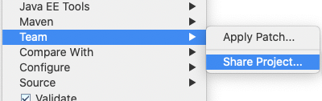

8. Now select Git, click Next. Then from the Repository list select the Git repository that you recently added to your workspace.

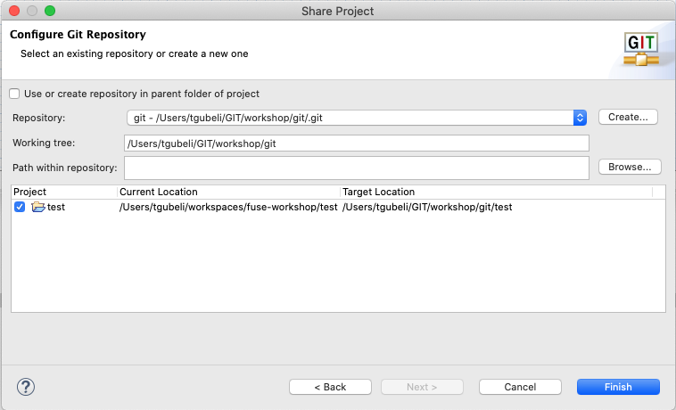

If all was ok, now you just linked your local project with the remote repo in the Git server. Next step, commit and push your code.

## Commit and push your code to remote Git repo.

1. In Git, first you have to add any new file to the local git repo index so that file can be versioned and be part of the repo. To do so, right click on your project, then "**Team > Add to index ...**"

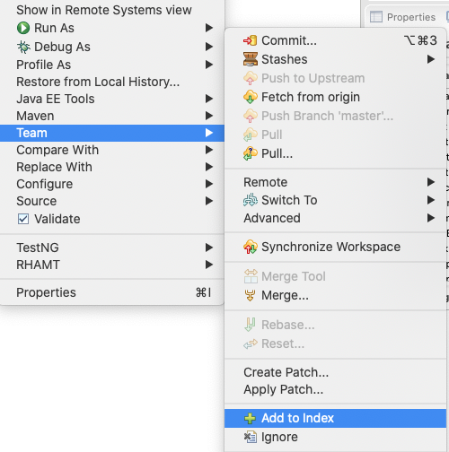

2. Now all yorur files are part of your local git repo and we can do a Commit and Push of our code/changes to the remote git repo. Right click on your project, then "**Team > Commit ...**"

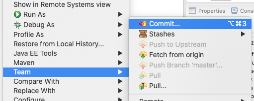

3. Put some comment and then click on Commit / Push button. Select **master** branch and put your user credentials when asked.

4. If all was ok, your code now is on the remote git repo.

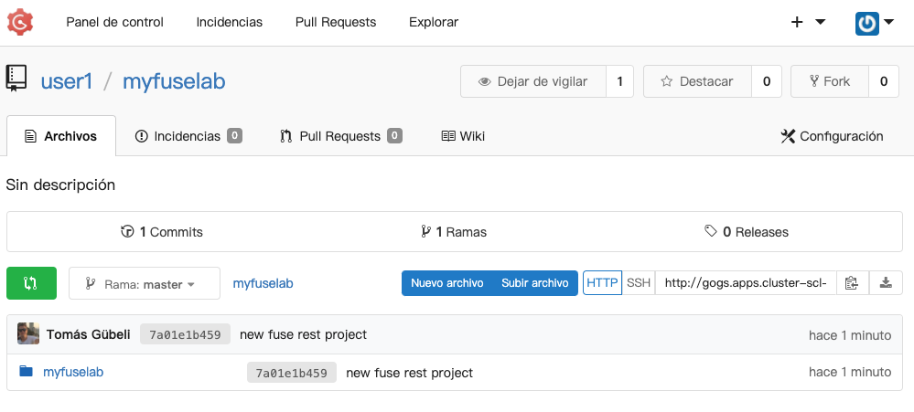

