## Lab four - Deploying to OpenShift
In this lab we are going to deploy our service into Openshift as a Container. But first, we are going to deploy a mysql instance (in Openshift to) in order to connect our app to a real RDBM, using a JDBC driver.

## First we need to be sure that all image streams for Fuse and MySQL are available in Openshift. With an Openshift admin user do the following:

1. Add the `mysql-ephemeral` and `FIS` templates:

   FIS images
   ```
   oc create -f https://raw.githubusercontent.com/jboss-fuse/application-templates/master/fis-image-streams.json -n openshift --as=system:admin
   ```
   MYSQL Database
   ```
   oc create -f https://raw.githubusercontent.com/openshift/origin/master/examples/db-templates/mysql-ephemeral-template.json -n openshift --as=system:admin
   ```


Now it's time to deploy the application onto OpenShift, we have been testing with the H2 Database in memory, now it's time to run it with a real database. Add the following datasource setting under *src/main/resources* in **application.properties**

```
#mysql specific
mysql.service.name=mysql
mysql.service.database=sampledb
mysql.service.username=dbuser
mysql.service.password=password

#Database configuration
spring.datasource.url = jdbc:mysql://${${mysql.service.name}.service.host}:${${mysql.service.name}.service.port}/${mysql.service.database}
spring.datasource.username = ${mysql.service.username}
spring.datasource.password = ${mysql.service.password}
```

Since we will be using MYSQL database, add the driver dependency in **pom.xml**

```
<dependency>
      <groupId>org.springframework.boot</groupId>
      <artifactId>spring-boot-starter-jdbc</artifactId>
</dependency>
<dependency>
      <groupId>mysql</groupId>
      <artifactId>mysql-connector-java</artifactId>
      <scope>runtime</scope>
</dependency>
```


Open OpenShift Explorer view, on the top menu select window -> Show view -> others. a window will popup. Type openshift in the search field. And select OpenShift Explorer

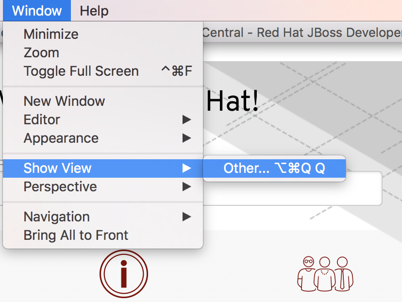

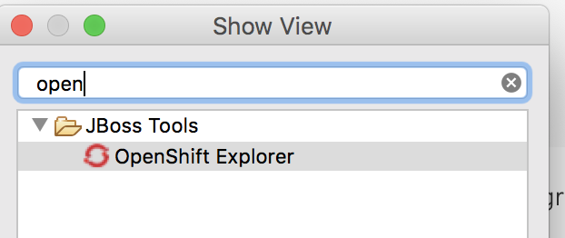

In OpenShift Explorer, right click on the connection that connects to current OpenShift, and create a new project. **NEW** -> **Project**

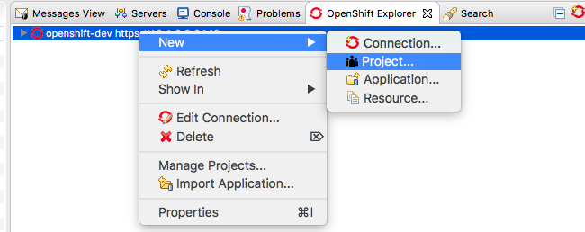

**Note:** If you haven't created a connection previously:

1. Click on **New Connection Wizard...** to configure OpenShift. Enter your web console URL address (https://&lt;OPENSHIFT-SERVER-IP&gt;:8443) as the **Server** and click on the **retrieve** link to access the token.
1. In the popup window, log in as Developer using ID/PWD developer/developer.

    

1. Click on **Close**
1. **UNCHECK** the *Save token* box and click Finish

    

And create Project Name: **myfuseproject** with Display Name: **My Fuse Project**

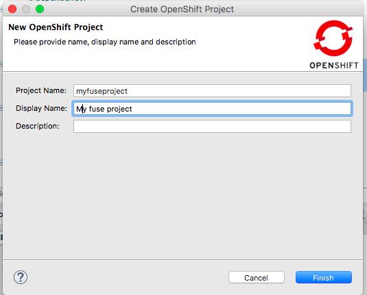

Inside the project we are going to first create a MYSQL database for our application. Right click on the new project name **myfuseproject** -> **New** -> **Application**

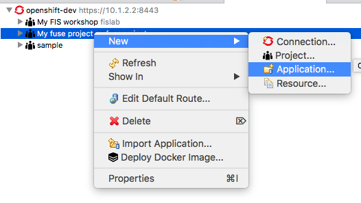

Under Server application source, select **mysql-ephemeral(database, mysql) - openshift** and click next.

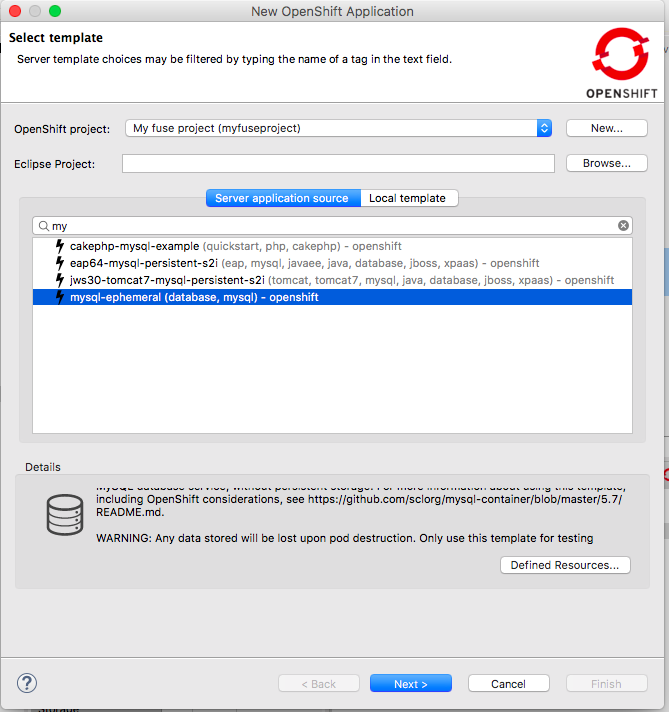

Make sure to configure the following parameters

```
MYSQL_PASSWORD = password
MYSQL_ROOT_PASSWORD = password
MYSQL_USER = dbuser
```
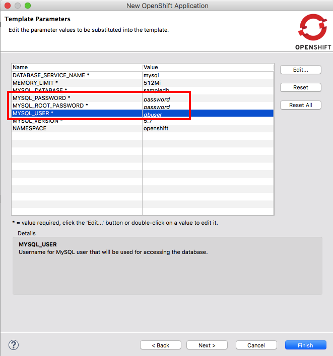

Click Finish, and you should see the mysql instance running in OpenShift explorer.

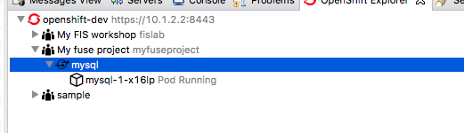


## Deploy the Rest service
Now we can finally push our application to OpenShift. 
1. Just like in the last step,   Right click on the new project name **myfuseproject** -> **New** -> **Application**
Then select an existing project, in this case "myfuselab". Then click "Ok"

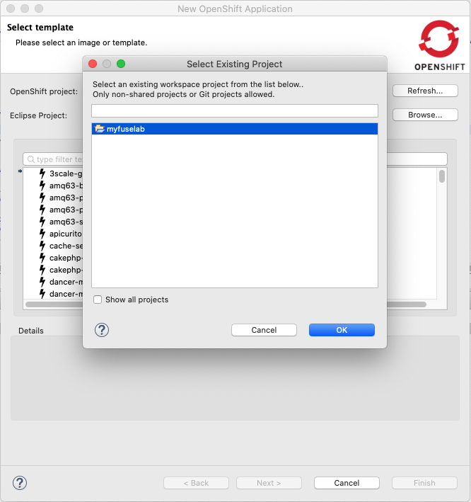

2. Now we must select a Fuse template in order to deploy the app on Openshift. When we use a template, Openshift use a strategy to create (build) new images called "S2I" or "Source to Image". Every template references a container Base Image, so the S2I build process take that as a reference in order to create a new image for you app, in other words, s2i creates a Container Image for your app automaticly. In this case we need a base image for Fuse 7 apps, so we need to select a template that match the runtime (Fuse) and the version that we are using, in this case Fuse 7.6. Just follow the images bellow.

> Note: In the image below there is not a template for Fuse 7.6 in the list, just go for the one that says Fuse 7.5, we can change de base image version later).

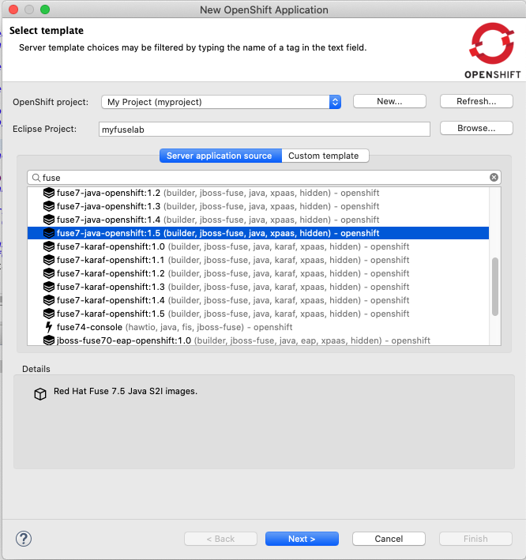

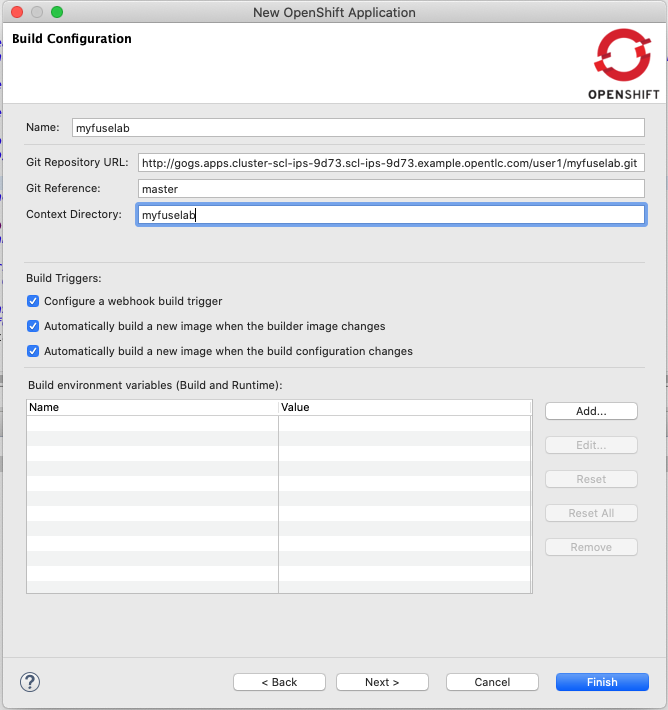

> Note: if there is no Fuse template for the version you need, just select the most update one and change the version of the base image as showed below:

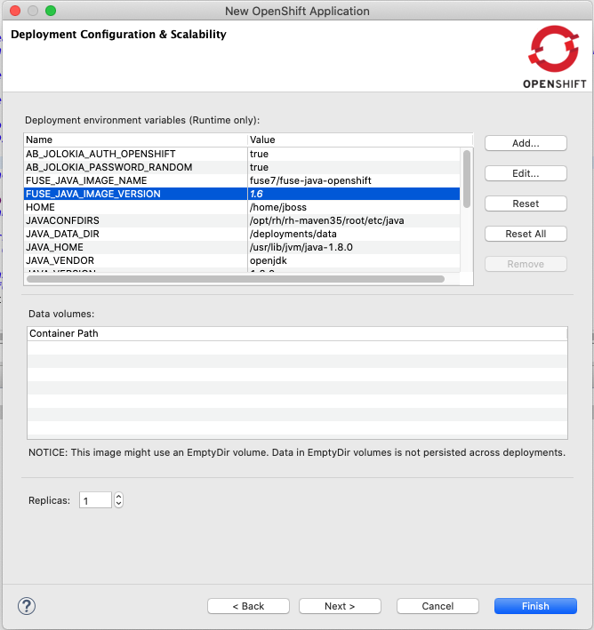

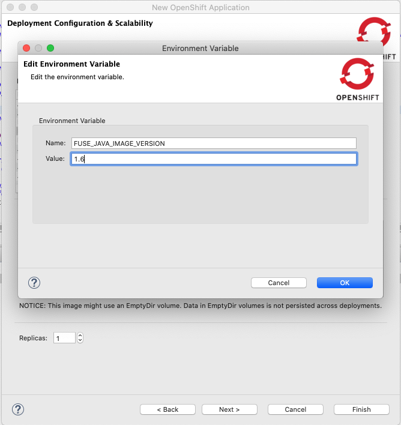

Then your project will be oned from Git repo, compiled the Java source, then Build the new container image in Openshift and then it will be deployed. All of this **automaticly**. 

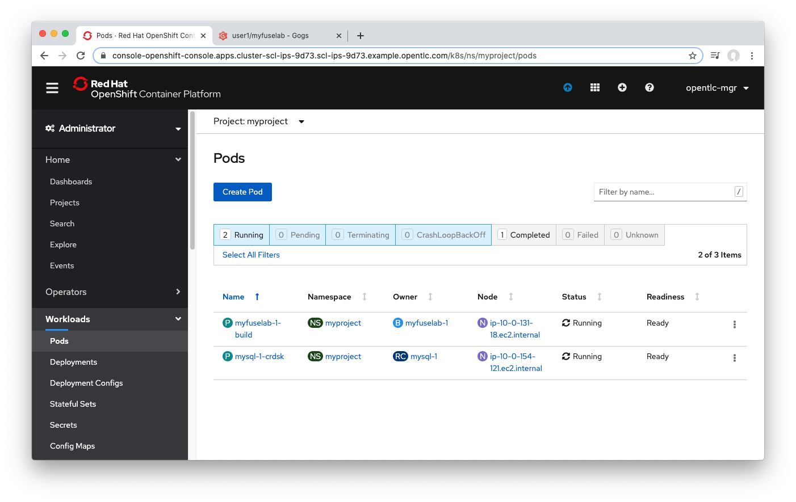

3. Access the API endpoint

But that's not all, a route was created automaticly for you too in order to exposed the app to the world! In Openshift web console, Look at the view "Developer > Topology". Then click en the icon in the upper right corner of your App in order to go to the app's URL:


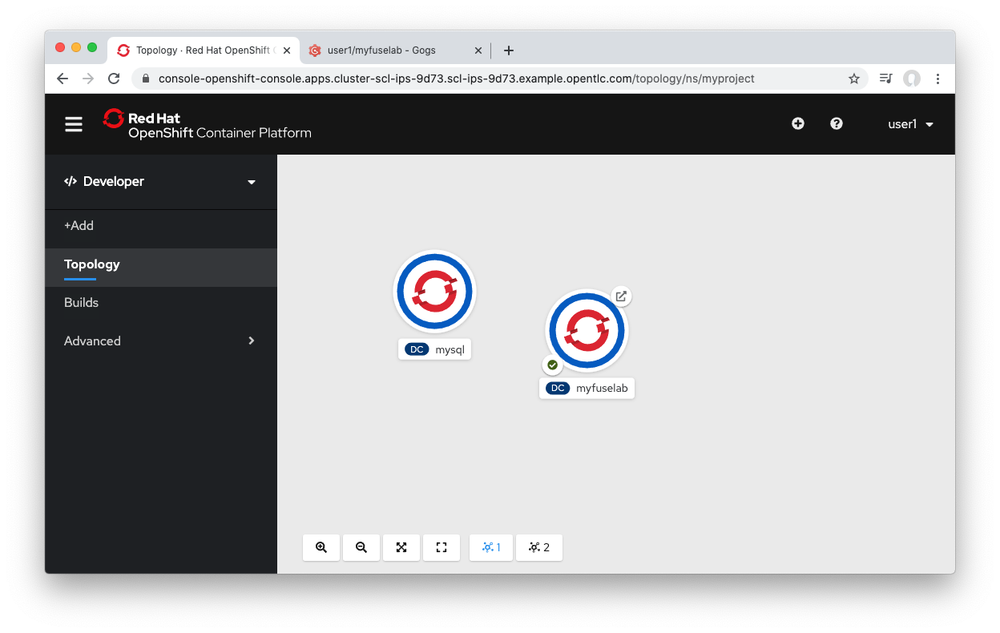


Access the API endpoint by going to following URL

```
curl http://<YOUR_ROUTE>/myfuselab/customer/all
curl  http://<YOUR_ROUTE>/myfuselab/customer/A01
```

Verify that it is returning customer data in JSON format
```
[{"CUSTOMERID":"A01","VIPSTATUS":"Diamond","BALANCE":1000},{"CUSTOMERID":"A02","VIPSTATUS":"Gold","BALANCE":500}]

[{"CUSTOMERID":"A01","VIPSTATUS":"Diamond","BALANCE":1000}]
```

For those of you who want to see what is going on in database, login to the MYSQL database in your command line console.

```
oc project myfuseproject

oc get pods
NAME                                   READY     STATUS    RESTARTS   AGE
myfuselab-2-rgjfd  						 1/1       Running   0          15s
mysql-1-xxxxx                           1/1       Running   0          2m

oc rsh mysql-1-xxxxx

sh-4.2$ mysql -udbuser -p sampledb
Enter password:

mysql> select * from customerdemo;
+------------+-----------+---------+
| customerID | vipStatus | balance |
+------------+-----------+---------+
| A01        | Diamond   |    1000 |
| A02        | Gold      |     500 |
+------------+-----------+---------+
2 rows in set (0.00 sec)
```
